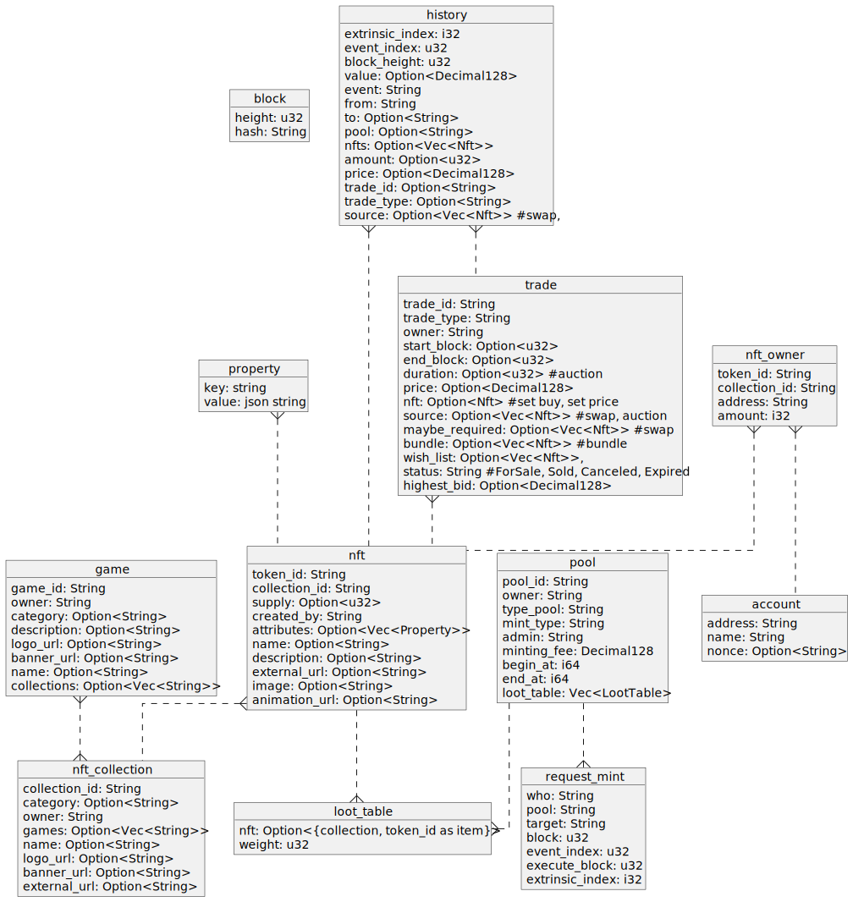

# GAFI Marketplace Backend

## Description

The GAFI Marketplace Backend is a backend project written in Rust that provides APIs for the GAFI Chain marketplace. It uses actix_web framework to handle HTTP requests and interacts with a MongoDB database. The project is organized as a cargo workspace with three main packages: `backend`, `worker`, and `shared`.

## Features

- RESTful APIs for the GAFI Chain marketplace
- Real-time event processing using the `worker` package

## Installation and Setup

To install and set up the project locally, follow these steps:

1. Ensure you have Rust and Cargo installed on your machine. If not, you can install them from [here](https://www.rust-lang.org/tools/install).

2. Clone the repository:

   ```shell
   git clone https://github.com/grindytech/gafi-market-be.git
   ```

3. Navigate to the project directory:

   ```shell
   cd gafi-market-be
   ```

4. Install the necessary dependencies:

   ```shell
   cargo build
   ```

5. Set up the environment variables by creating a `.env` file in the project root directory. Use the provided `.env.example` file as a template and fill in the required values.

6. Start the backend server:

   ```shell
   cargo run -p backend
   ```

   The server should now be running on `http://localhost:8080`.

7. Start the worker
   ```shell
   cargo run -p worker
   ```

7. (Optional) We use `mongodb-memory-server` to unit test, so if you want to run unit tests, you need to install Node.js and the required dependencies. Run the following commands:

   ```shell
   npm install
   ```

   After that, you can run the unit tests using the following command:

   ```shell
   cargo test
   ```

## Project Structure

The project is organized as follows:

- `backend`: Contains the code for the RESTful APIs using the actix_web framework.
- `worker`: Listens for new blocks and processes events.
- `shared`: Contains common code such as models, utils, types, constants, and database connection.

## Configuration

The project uses environment variables for configuration. Create a `.env` file in the project root directory and fill in the required values. The following variables are used:

- `MONGODB_URI`: The URI for connecting to the MongoDB database.
- `MONGODB_DB_NAME`: The name of the MongoDB database.
- `JWT_TOKEN_SECRET`: The secret key used for JWT token generation and validation.
- `JWT_EXPIRE_TIME`: The expiration time for JWT tokens.
- `START_BLOCK`: The block height that worker begin handle.
- `RPC`: The websocket rpc uri.

## Architecture

<div hidden style="visibility:hidden">


</div>


## Database schema

<div hidden style="visibility:hidden">


</div>



## Contributing

If you would like to contribute to the project, please follow these guidelines:

1. Fork the repository and clone it to your local machine.
2. Create a new branch for your feature or bug fix.
3. Make your changes and commit them to your branch.
4. Push your branch to your forked repository.
5. Open a pull request to the main repository.

## License

This project is licensed under the [MIT License](LICENSE).

